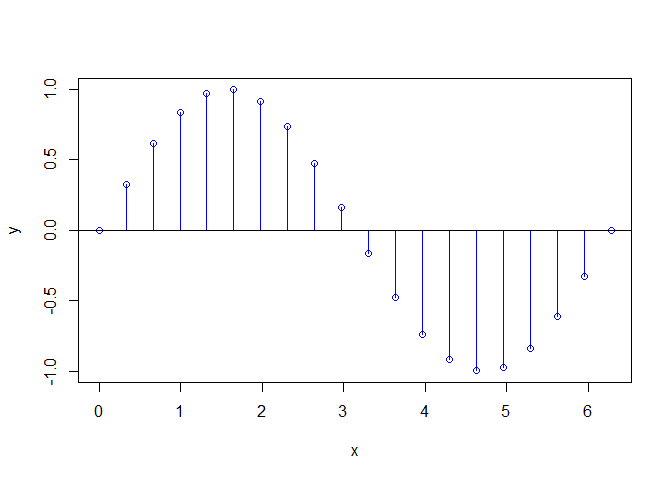

# tbTools
*Tomas' personal mix of utilities*

Mix of things that I missed in R. Matlab-like colon operator, stem plot (base plotting system), round2 with order, ifft etc.

`seqM` Matlab-like behaviour of colon operator or linspace for creating sequences, for-loop friendly.

`round2` Rounds a number to the specified order. Round half away from zero (this is the difference from built-in \code{round} function.)

`ifft` Inverse Fast Fourier Transform (discrete FT), Matlab-like behavior.

`Stem` Matlab-like stem plotting function for discrete series.

`isInt` Returns TRUE / FALSE whether it is exactly 1 integer number (in fact, the class can be numeric but the number must be integer), non-missing

`isNum` Returns TRUE / FALSE whether it is exactly 1 number (numeric or integer vector of length 1, non-missing)

`isString` Returns TRUE / FALSE whether it is exactly 1 character string (character vector of length 1, non-missing)

`strTrim` Trim leading and trailing whitespace in character string. Way faster than str_trim() or trimws().

`str_contains` Find string in another string (without regular expressions), returns TRUE / FALSE.

`str_find` Find string in another string (without regular expressions), returns indices of all occurences.

`str_find1` Find string in another string (without regular expressions), returns indices of the first occurence only.

### Installation


```r
install.packages("devtools")
devtools::install_github("bbTomas/tbTools")
```

### Documentation
Reference manual 1.0.0: [tbTools.pdf](tbTools.pdf).

### Examples

Finally Matlab-like sequences in R (colon operator with *by* or linspace with *length.out*). For-loop safe. Default step is always `by=+1` (no guessing) and if you do `seqM(3, 1, by=+1)` it produces an empty vector (so in for-loop, the statements are not proceeded) instead of error (result of classic `seq` in R).


```r
library(tbTools)
```

#### seqM

```r
seqM(1, 3)
```

```
## [1] 1 2 3
```

```r
seqM(1, 3, by=.8)
```

```
## [1] 1.0 1.8 2.6
```

```r
seqM(1, 3, by=5)
```

```
## [1] 1
```

```r
seqM(3, 1)
```

```
## integer(0)
```

```r
seqM(3, 1, by=+1)
```

```
## integer(0)
```

```r
seqM(3, 1, by=-1)
```

```
## [1] 3 2 1
```

```r
seqM(3, 1, by=-3)
```

```
## [1] 3
```

```r
seqM(1, 3, len=5)
```

```
## [1] 1.0 1.5 2.0 2.5 3.0
```

```r
seqM(1, 3, len=3)
```

```
## [1] 1 2 3
```

```r
seqM(1, 3, len=2)
```

```
## [1] 1 3
```

```r
seqM(1, 3, len=1)
```

```
## [1] 3
```

```r
seqM(1, 3, len=0)
```

```
## Warning in seqM(1, 3, len = 0): length.out == 0, return empty vector
```

```
## integer(0)
```

```r
seqM(3, 1, len=3)
```

```
## [1] 3 2 1
```

#### ifft

```r
ifft(fft(1:5))
```

```
## [1] 1+0i 2+0i 3+0i 4+0i 5+0i
```

#### isSomething

```r
isInt(2)
```

```
## [1] TRUE
```

```r
isInt(2L)
```

```
## [1] TRUE
```

```r
isInt(2.1)
```

```
## [1] FALSE
```

```r
isInt(1:5)
```

```
## [1] FALSE
```

```r
isNum(2L)
```

```
## [1] TRUE
```

```r
isNum(-2.1)
```

```
## [1] TRUE
```

```r
isNum("-2.1")
```

```
## [1] FALSE
```

```r
isString("hello")
```

```
## [1] TRUE
```

```r
isString(5)
```

```
## [1] FALSE
```

#### round2

```r
round2(23.5)
```

```
## [1] 24
```

```r
round2(23.4)
```

```
## [1] 23
```

```r
round2(24.5)
```

```
## [1] 25
```

```r
round2(-23.5)
```

```
## [1] -24
```

```r
round2(-23.4)
```

```
## [1] -23
```

```r
round2(-24.5)
```

```
## [1] -25
```

```r
round2(123.456, -1) 
```

```
## [1] 123.5
```

```r
round2(123.456, -2) 
```

```
## [1] 123.46
```

```r
round2(123.456, 1)
```

```
## [1] 120
```

```r
round2(123.456, 2)
```

```
## [1] 100
```

```r
round2(123.456, 3)
```

```
## [1] 0
```

#### Stem: Matlab-like stem plot for discrete series in R

```r
t <- seqM(from = 0, to = 2*pi, length.out = 20)
Stem(t, sin(t))
```


```r
Stem(t, sin(t), pch=21, linecol = "blue")
```



### Character string operations

```r
strTrim(" Hello World! ")   # much faster than str_trim() in stringr package or trimws() in R3.2.0
```

```
## [1] "Hello World!"
```

```r
# easy and comfortable string operations without regular expressions
str_contains("Hello world", "wor")
```

```
## [1] TRUE
```

```r
str_contains("Hello world", "WOR")
```

```
## [1] FALSE
```

```r
str_contains(tolower("Hello world"), tolower("wor"))
```

```
## [1] TRUE
```

```r
str_find("Hello, hello, hello world", "ell")
```

```
## [1]  2  9 16
```

```r
str_find("Hello, hello, hello world", "q")
```

```
## integer(0)
```

```r
str_find1("Hello, hello, hello world", "ell")
```

```
## [1] 2
```

```r
str_find1("Hello, hello, hello world", "q")
```

```
## integer(0)
```
